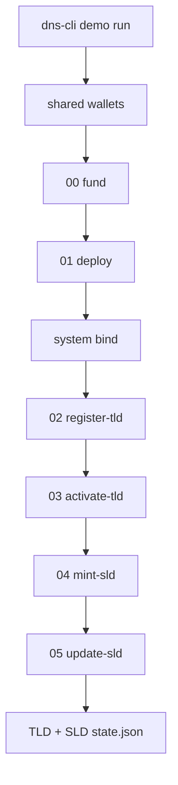

# Preprod demo guide

This document describes the **dns-cli Preprod demo**: what it does, how to run it, what you must provide, what you get back, and what is safe to customize.

Local quickstart: [`demo/README.md`](../demo/README.md).

## What it is

The demo is a resumable, operator-driven end-to-end walkthrough of the Handshake DNS Cardano lifecycle on **Preprod**:

1. Create (or reuse) actor wallets
2. Wait for faucet funding of the bootstrap wallet
3. Split ADA to registrar / TLD owner / SLD owner (`wallet fund`)
4. Parameterize and deploy reference scripts (`system prepare` + `system init`)
5. Register a TLD (`registrar register-tld`)
6. Activate the TLD (`owner activate-tld`)
7. Mint an SLD under that TLD (`owner mint-sld`)
8. Publish DNS records for the SLD (`owner update-sld`)

Orchestration is implemented in Go as `dns-cli demo run` (package `internal/demo`). Shell scripts under `demo/scripts/` are thin wrappers that map flags and invoke the CLI. Each on-chain step is built via ops helpers, then confirmed with `tx apply` (sign → submit → wait). Faucet waiting uses `wallet wait-funds`. Progress is stored under `demo/runs/` so an interrupted run can resume without re-submitting confirmed transactions.



## Modes

| Mode | Behavior |
|---|---|
| `fresh` | Live Preprod submissions. Creates/updates `runs/` layout, prompts for missing credentials, waits for faucet funds. |
| `existing` | **Read-only** history viewer (same as `demo history`). Prints confirmed tx IDs and Preprod explorer URLs. Does **not** create run folders or submit transactions. |

## Directory layout

```text
demo/
  README.md
  scripts/
    run-demo.ps1
    run-demo.sh
  config/
    blockfrost.template.json   # input to system bind
    utxorpc.template.json
    records.json               # DNS records template → copied into each SLD run
  fixtures/
    contracts/                 # Aiken project + plutus.json for system prepare
  runs/
    .gitkeep
    states/                    # tracked schemas (tld / sld / run / index)
    shared/                    # generated: wallets, .env, tools
    <tld>/                     # generated: contracts, proofs, config, artifacts 00–03, TLD state
    <tld>/<sld>/<runId>/       # generated: run.json, records.json, artifacts 04–05, SLD state
```

### What is tracked vs generated

| Path | Role |
|---|---|
| `scripts/`, `config/`, `fixtures/contracts/`, `runs/states/` | Source / templates — commit these |
| `runs/<tld>/` (state, artifacts, configs, contracts, records) | Demo history — committed (Preprod) |
| `runs/shared/` (wallets, `.env`, tools) | Preprod demo material — committed intentionally (revocable test keys) |

Schemas live under `runs/states/` and are versioned with the rest of `demo/runs/` (Preprod demo history is tracked intentionally).

## Requirements

### Always (to run the scripts)

| Item | Notes |
|---|---|
| PowerShell 7+ **or** Bash | Prefer `pwsh` on Windows; Bash runner needs `jq` |
| Network access | Preprod provider + faucet |

### Fresh mode only

| Item | Notes |
|---|---|
| Go **1.25.10+** | To build `dns-cli` if the binary is missing (Apollo via `go.mod` replace; no local sibling checkout) |
| `dns-cli` binary | Prefer `bin/dns-cli(.exe)`; wrappers ask before building there. Also: tree root, `PATH`, or `CLI=` |
| Aiken CLI **≥ 1.1.19** | Must match `fixtures/contracts/aiken.toml` compiler |
| Provider credentials | See below |
| ≥ **150 ADA** on bootstrap | Preprod faucet; runner polls until funded |

### Provider credentials

**Blockfrost**

- Env: `DNS_CLI_BLOCKFROST_PROJECT_ID`
- Dashboard: https://blockfrost.io/dashboard

**UTxO RPC**

- Env: `DNS_CLI_UTXORPC_URL` (required)
- Optional: `DMTR_API_KEY` (Demeter), `DNS_CLI_UTXORPC_HEADERS` (`Key=Value,...`)

Credentials can be saved interactively to `demo/runs/shared/.env` (tracked as Preprod demo material — treat as test-only). Process env always wins over `.env`.

### Flags and env helpers

| Flag / env | Effect |
|---|---|
| `-Yes` / `--yes` / `DEMO_ASSUME_YES=1` | Auto-approve prereq installs, default setting prompts, wallet reuse |
| `-SkipInstall` / `--skip-install` | Print guides only; do not install tools or write `.env` |
| `-LogLevel` / `--log-level` / `DEMO_LOG_LEVEL` | `quiet` \| `normal` \| `extensive` |
| `-ExtensiveLogging` / `-E` / `DEMO_EXTENSIVE_LOGGING=1` | Extensive runner + raised dns-cli `-v` |
| `DEMO_MODE` / `DEMO_PROVIDER` | Defaults when flags omitted |
| `CLI` | Path to dns-cli binary |

## How to run

Prefer `dns-cli demo run` from the **module root** (or any cwd with an absolute `--demo-root`). Wrappers under `demo/scripts/` are optional.

### Fresh (Blockfrost)

```bash
export DNS_CLI_BLOCKFROST_PROJECT_ID=preprod...
dns-cli demo run --demo-root demo --mode fresh --provider blockfrost
```

```powershell
$env:DNS_CLI_BLOCKFROST_PROJECT_ID = 'preprod...'
dns-cli demo run --demo-root demo --mode fresh --provider blockfrost
# or from demo/:
.\scripts\run-demo.ps1 -Mode fresh -Provider blockfrost
```

```bash
# from demo/ via wrapper:
export DNS_CLI_BLOCKFROST_PROJECT_ID=preprod...
./scripts/run-demo.sh --mode fresh --provider blockfrost
```

Optional labels:

```bash
dns-cli demo run --demo-root demo --mode fresh --provider blockfrost --tld mytld --sld www
```

```powershell
.\scripts\run-demo.ps1 -Mode fresh -Provider blockfrost -Tld mytld -Sld www
```

```bash
./scripts/run-demo.sh --mode fresh --provider blockfrost --tld mytld --sld www
```

### Resume after interruption

Re-run without flags (or with the same mode/provider/tld/sld). Confirmed steps are skipped.

```bash
dns-cli demo run --demo-root demo
```

```powershell
.\scripts\run-demo.ps1
```

```bash
./scripts/run-demo.sh
```

### Existing (history viewer)

```bash
dns-cli demo history
dns-cli demo run --demo-root demo --mode existing
```

```powershell
.\scripts\run-demo.ps1 -Mode existing
```

```bash
./scripts/run-demo.sh --mode existing
```

If no TLD folders exist under `runs/` yet, the viewer prints:

`no demo history yet (run a fresh demo first)`

`demo history` auto-finds `demo/runs` by walking upward from the current directory:

```bash
dns-cli demo history
```

Optional override:

```bash
dns-cli demo history --runs-root /path/to/demo/runs
```

### Primary entrypoints

```bash
dns-cli demo run --demo-root demo --mode fresh --provider blockfrost
dns-cli demo run --demo-root demo --mode existing
# or wrappers from demo/:
./scripts/run-demo.sh --mode fresh --provider blockfrost
```

### CLI primitives (also usable standalone)

| Step | Command |
|---|---|
| Faucet wait | `dns-cli wallet wait-funds --actor bootstrap --min-lovelace 150000000` |
| Sign + submit + confirm | `dns-cli tx apply --tx … --actor … --signed … --manifest …` |
| History viewer | `dns-cli demo history` (auto-finds `demo/runs`) |

### Interactive prompts (fresh)

When a flag is omitted, the runner shows a default (from prior `runs/<tld>/state.json`, `DEMO_*` env, or built-in) and asks whether to keep it:

- `mode`, `provider`, `tld`, `sld`

Existing wallets under `runs/shared/wallets/{bootstrap,registrar,tld-owner,sld-owner}`:

1. Addresses and bootstrap balance are printed
2. You may **reuse** them (default Yes when ≥ 150 ADA)
3. Declining archives to `runs/shared/wallets-archive-<timestamp>/` and creates a new set

Before submissions, the runner prints a preflight summary (shared / TLD / SLD-run roots), a **7-step roadmap** ending in `update-sld` (DNS records), and asks:

`Proceed with Preprod submissions? [y/N]`

During the run, colored **human reports** on stdout (not slog) narrate the flow:

- ASCII **dns-cli** brand splash at fresh-run start (mode / provider / name chips)
- Live **roadmap** checklist in preflight and history (done / current / pending)
- Step banners, wallet/funding panels, and the completion report with explorer links

The same styling is used for other `dns-cli` human stdout (`--output human`), including `version` and command success panels. PowerShell and Bash wrappers share this look because both call the Go binary. Disable ANSI with `--no-color` or `NO_COLOR=1`.

Technical logs stay on stderr and are unchanged by these banners.

## Funding budget

After bootstrap holds ≥ 150 ADA, the fund step allocates (plus 5 ADA collateral each):

| Actor | Allocation |
|---|---|
| registrar | 30 ADA |
| tldOwner | 50 ADA |
| sldOwner | 30 ADA |

Remainder covers deployment fees and buffers. Fund the printed bootstrap address via the [Cardano Preprod faucet](https://docs.cardano.org/cardano-testnets/tools/faucet/).

## Expected results

### State files

| File | Confirmed steps |
|---|---|
| `runs/<tld>/state.json` | `fund`, `deploy`, `register`, `activate` |
| `runs/<tld>/<sld>/<runId>/state.json` | `mintSld`, `updateSld` |

Each confirmed entry stores `txId` and an absolute `manifest` path.

### Artifacts

| Prefix | Location | Command |
|---|---|---|
| `00-fund` | `runs/<tld>/artifacts/` | `wallet fund` |
| `01-deploy` | `runs/<tld>/artifacts/` | `system init` |
| `02-register` | `runs/<tld>/artifacts/` | `registrar register-tld` |
| `03-activate` | `runs/<tld>/artifacts/` | `owner activate-tld` |
| `04-mint-sld` | `runs/<tld>/<sld>/<runId>/artifacts/` | `owner mint-sld` |
| `05-update-sld` | `runs/<tld>/<sld>/<runId>/artifacts/` | `owner update-sld` |

Each step typically produces `.unsigned.json`, `.signed.json`, and `.manifest.json`.

### Other outputs

| Path | Contents |
|---|---|
| `runs/<tld>/contracts/` | Parameterized blueprints / addresses from `system prepare` |
| `runs/<tld>/proofs/` | HNS keys + `proof-bundle.json` |
| `runs/<tld>/config/bootstrap.json` | Early config (placeholders until bind) |
| `runs/<tld>/config/{blockfrost\|utxorpc}.json` | Bound provider config after deploy |
| `runs/<tld>/<sld>/<runId>/records.json` | Copy of records used for that run |
| `runs/<tld>/<sld>/<runId>/run.json` | Human metadata (paths, runId, createdAt) |

### Explorer

Confirmed txs are viewable at:

`https://preprod.cexplorer.io/tx/<txId>`

The success summary and `existing` mode both print these links.

## Resume and history rules

1. **TLD state is shared** across SLD runs for the same TLD. Re-running with the same `-Tld` skips already-confirmed fund/deploy/register/activate.
2. **SLD runs are timestamped.** Under `runs/<tld>/<sld>/`, if the **latest** run folder has empty `mintSld` or `updateSld` txId, that `runId` is resumed. Otherwise a new `yyyyMMdd-HHmmss` folder is created and `config/records.json` is copied in.
3. **Existing mode never mutates** the tree (no new folders, no state writes).

## What you can change

Safe operator customizations:

| Item | How |
|---|---|
| DNS records content | Edit `demo/config/records.json` **before** a new SLD run (or edit the run’s copy before `update-sld` if still incomplete) |
| TLD / SLD labels | `-Tld` / `-Sld` or `--tld` / `--sld` |
| Provider | `-Provider blockfrost\|utxorpc` |
| Logging detail | `-LogLevel Extensive` / `--log-level extensive` |
| Auto-approve prompts | `-Yes` / `DEMO_ASSUME_YES=1` |
| Which wallets to use | Reuse vs archive+regenerate when prompted |
| Credentials location | Process env or `runs/shared/.env` |

## What you should not change casually

| Item | Why |
|---|---|
| `fixtures/contracts/` compiler pin / blueprint | Must stay aligned with Aiken ≥ 1.1.19 and prepare/init |
| `runs/states/*.schema.json` version fields | Runners expect `schemaVersion: 2` for TLD/SLD state |
| Relative paths inside generated bootstrap/bound configs | Resolved against `runs/<tld>/config/`; rewriting by hand breaks signing |
| Deleting `runs/<tld>/state.json` while keeping on-chain UTxOs | Resume will try to rebuild/resubmit and can fail against already-spent outputs |
| Mainnet / Preview networks | Demo runners and mutating commands are Preprod-oriented |

## Security

- All demo wallets and HNS keys under `runs/shared/` are **Preprod test material** — never reuse on mainnet.
- Demo Preprod wallets, `.env` project ids, and `*.hns` keys under `demo/runs/` are committed intentionally for reproducible demos; treat them as public test credentials and revoke/rotate anytime.
- Fixture contract sources and TLD/SLD run history under `runs/<tld>/` are public Preprod sample material, not production secrets.

## Troubleshooting (short)

| Symptom | Likely fix |
|---|---|
| `dns-cli` not found | Build from module root or set `CLI=` |
| Aiken version too old | Upgrade to ≥ 1.1.19 |
| Auth / 401 from Blockfrost | Check `DNS_CLI_BLOCKFROST_PROJECT_ID` / `.env` |
| Stuck waiting for funds | Fund the printed bootstrap address on Preprod faucet |
| Step skipped incorrectly | Inspect `runs/<tld>/state.json` or SLD `state.json` txIds |
| Want a clean SLD attempt | Use a new `-Sld` or wait until the latest run is complete so a new `runId` is created; do not hand-delete TLD state if chain UTxOs still exist |

For general CLI issues see [troubleshooting.md](troubleshooting.md), [configuration.md](configuration.md), and [commands.md](commands.md).

## Related docs

- [demo/README.md](../demo/README.md) — local quickstart
- [installation.md](installation.md)
- [configuration.md](configuration.md)
- [commands.md](commands.md)
- [security.md](security.md)
- [operator-guide.md](operator-guide.md)
